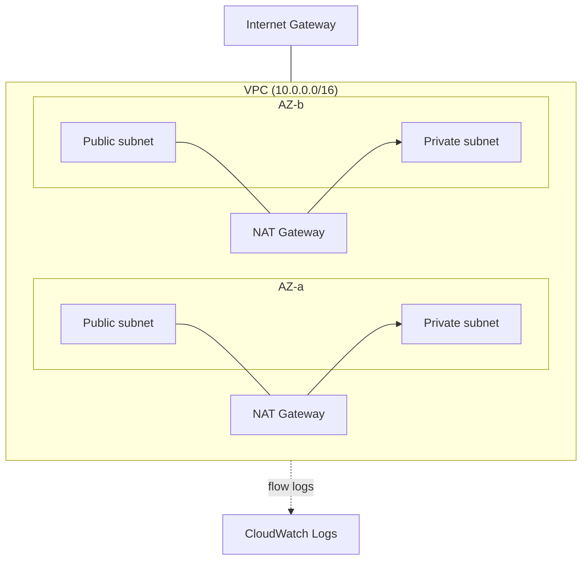

# terraform-aws-vpc

Terraform that provisions a production-shaped AWS VPC: public and private subnets spread across multiple Availability Zones, NAT gateway(s) for private-subnet egress, route tables, and VPC flow logs shipped to CloudWatch.

## Architecture



## What gets created

| Resource | Purpose |
|---|---|
| `aws_vpc` | The VPC itself, with DNS support and hostnames enabled |
| `aws_subnet` (public/private) | One of each per AZ, CIDRs derived with `cidrsubnet()` |
| `aws_internet_gateway` | Egress for public subnets |
| `aws_nat_gateway` + `aws_eip` | Egress for private subnets — one per AZ by default, or one shared gateway if `single_nat_gateway = true` |
| `aws_route_table` (public/private) | Public subnets route to the IGW; private subnets route to their NAT gateway |
| `aws_flow_log` + CloudWatch log group + IAM role | Captures ALL traffic (accept and reject) for the VPC |

## Prerequisites

- Terraform 1.6 or newer
- AWS credentials with permission to create VPC, EC2, IAM, and CloudWatch Logs resources

## Quick start

```bash
git clone https://github.com/metalaranna/terraform-aws-vpc.git
cd terraform-aws-vpc

cp terraform.tfvars.example terraform.tfvars
# Edit name, vpc_cidr, az_count as needed

terraform init
terraform plan
terraform apply
```

## Configuration

| Variable | Default | Description |
|---|---|---|
| `region` | `us-east-1` | AWS region |
| `name` | `app` | Name prefix for all resources |
| `vpc_cidr` | `10.0.0.0/16` | VPC CIDR block |
| `az_count` | `2` | Number of AZs to span (minimum 2, enforced by validation) |
| `public_subnet_newbits` / `private_subnet_newbits` | `8` | Extra bits used by `cidrsubnet()` to size each subnet (`/16` + 8 = `/24`) |
| `enable_nat_gateway` | `true` | Whether private subnets get outbound internet access |
| `single_nat_gateway` | `false` | Use one shared NAT gateway instead of one per AZ (cheaper, single point of failure) |
| `enable_flow_logs` | `true` | Send VPC flow logs to CloudWatch |
| `flow_log_retention_days` | `30` | Flow log retention |
| `tags` | `{}` | Extra tags merged onto every resource |

## Design notes / trade-offs

- **One NAT gateway per AZ** is the resilient default: if an AZ fails, only that AZ's private subnet loses egress. Each NAT gateway has an hourly charge plus data processing cost, so for a dev/sandbox environment set `single_nat_gateway = true` to cut cost at the price of a shared failure point.
- **Flow logs** default to `ALL` traffic (accepted and rejected), which is useful for both troubleshooting and security review, but adds CloudWatch Logs ingestion cost at scale. Turn `enable_flow_logs = false` off for a throwaway environment.
- This module deliberately stays subnet/routing-focused. It does not create security groups, VPC endpoints, or Transit Gateway attachments — those are better scoped to the workload repo that consumes this VPC (see [terraform-aws-ec2-userdata](https://github.com/metalaranna/terraform-aws-ec2-userdata) and [terraform-aws-amazon-mq](https://github.com/metalaranna/terraform-aws-amazon-mq) for examples that take `vpc_id`/`subnet_id` as inputs).

## Cost

NAT gateways are the main recurring cost (hourly + per-GB processed). Flow logs add CloudWatch ingestion/storage cost proportional to traffic volume. Check current [VPC pricing](https://aws.amazon.com/vpc/pricing/) for your region.

## Cleanup

```bash
terraform destroy
```

## Development

```bash
terraform fmt -recursive
terraform init -backend=false
terraform validate
```

The same checks run in GitHub Actions on every push and pull request.

## License

MIT. See [LICENSE](LICENSE).
