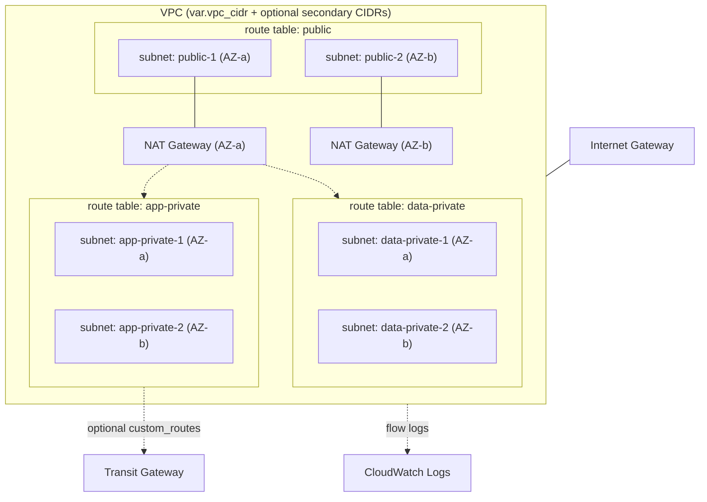

# terraform-aws-vpc

Terraform that provisions an AWS VPC using a fully parameterized subnet and route-table design: instead of a fixed public/private-per-AZ layout, you describe your own subnets and route tables as maps, and the module wires up the VPC, IGW, NAT gateway(s), route tables, associations, and VPC flow logs around them.

This shape comes from a common enterprise pattern: multiple services (an API gateway tier, an application tier, a data tier, and so on) each needing their own subnets and often their own route table, sometimes spanning more than one environment inside the same VPC. Rather than hardcoding those service names, this module takes them as data.

## Architecture



The diagram shows the example in `terraform.tfvars.example`: two AZs, three route tables (one public, two private), NAT gateways per AZ, and an optional Transit Gateway route hanging off one private table. Your own `subnets`/`route_tables` maps can have as many or as few groups as you need.

## What gets created

| Resource | Purpose |
|---|---|
| `aws_vpc` (+ optional `aws_vpc_ipv4_cidr_block_association`) | The VPC, with DNS support/hostnames enabled and room to grow via `secondary_cidr_blocks` |
| `aws_subnet` (`for_each` over `var.subnets`) | One subnet per map entry — no fixed public/private-per-AZ assumption |
| `aws_internet_gateway` | Egress target for public route tables |
| `aws_nat_gateway` + `aws_eip` | One per AZ that has a public subnet (or one shared, if `single_nat_gateway = true`) |
| `aws_route_table` (`for_each` over `var.route_tables`) | One per logical group you define, not one per AZ |
| `aws_route` (public default, private NAT default, custom) | Public tables → IGW; private tables → NAT (chosen by the table's optional `az`, or the first/shared NAT); any `custom_routes` you list (e.g. toward a Transit Gateway) |
| `aws_route_table_association` | Wires each subnet to the route table named in its `route_table` field |
| `aws_flow_log` + CloudWatch log group + IAM role | Captures ALL traffic (accept and reject) for the VPC |

## Prerequisites

- Terraform 1.6 or newer
- AWS credentials with permission to create VPC, EC2, IAM, and CloudWatch Logs resources

## Quick start

```bash
git clone https://github.com/metalaranna/terraform-aws-vpc.git
cd terraform-aws-vpc

cp terraform.tfvars.example terraform.tfvars
# Replace every CIDR, AZ, and name with your own — the example values are
# placeholders, not a real network plan.

terraform init
terraform plan
terraform apply
```

## Configuration

| Variable | Default | Description |
|---|---|---|
| `region` | `us-east-1` | AWS region |
| `name` | `app` | Name prefix for VPC-level resources (VPC, IGW, flow log group) |
| `vpc_cidr` | `10.0.0.0/16` | Primary VPC CIDR block |
| `secondary_cidr_blocks` | `[]` | Extra CIDR blocks to associate with the VPC |
| `subnets` | — (required) | Map of subnets: `name`, `cidr`, `az`, `type` (`public`/`private`), `route_table` (key into `route_tables`), optional `tags` |
| `route_tables` | — (required) | Map of route tables: `name`, `type` (`public`/`private`), optional `az` (which AZ's NAT gateway a private table's default route uses), optional `custom_routes` (list of `{ cidr, target_type }`) |
| `transit_gateway_id` | `null` | Required if any `custom_routes` entry uses `target_type = "tgw"` |
| `enable_nat_gateway` | `true` | Whether private route tables get outbound internet access via NAT |
| `single_nat_gateway` | `false` | One shared NAT gateway instead of one per AZ (cheaper, single point of failure) |
| `enable_flow_logs` | `true` | Send VPC flow logs to CloudWatch |
| `flow_log_retention_days` | `30` | Flow log retention |
| `tags` | `{}` | Extra tags merged onto every resource |

## Design notes / trade-offs

- **Route tables are logical groups, not one-per-AZ.** A single route table (say, `app-private`) can span subnets in multiple AZs. That matches how many organizations actually group subnets — by tier or by service — rather than strictly by AZ. The trade-off: a private route table's default NAT route points at exactly one NAT gateway (set via that table's optional `az`, or the first/shared one), so subnets in a different AZ than that NAT gateway still get outbound access, just not AZ-local NAT. If you need strict per-AZ NAT isolation, give every AZ its own route table.
- **`custom_routes` currently supports `target_type = "tgw"`** as the one non-default route target, since that's the most common reason to add a route to an otherwise NAT/IGW-only table. Extend the `target_type == "tgw" ? ... : null` ternary in `main.tf` if you need another target (a peering connection, a Gateway Load Balancer endpoint, and so on).
- **Validation catches two common mistakes at plan time**: a subnet whose `route_table` doesn't exist in `var.route_tables`, and a `custom_routes` entry with `target_type = "tgw"` while `var.transit_gateway_id` is null.
- **Secondary CIDRs** are for growing a VPC past its original block (a second environment's subnets, for example) without recreating it. Subnets are created with `depends_on` the CIDR association so Terraform sequences them correctly.

## Cost

NAT gateways are the main recurring cost (hourly + per-GB processed). Flow logs add CloudWatch ingestion/storage cost proportional to traffic volume. Check current [VPC pricing](https://aws.amazon.com/vpc/pricing/) for your region.

## Cleanup

```bash
terraform destroy
```

## Development

```bash
terraform fmt -recursive
terraform init -backend=false
terraform validate
```

The same checks run in GitHub Actions on every push and pull request.

## License

MIT. See [LICENSE](LICENSE).
